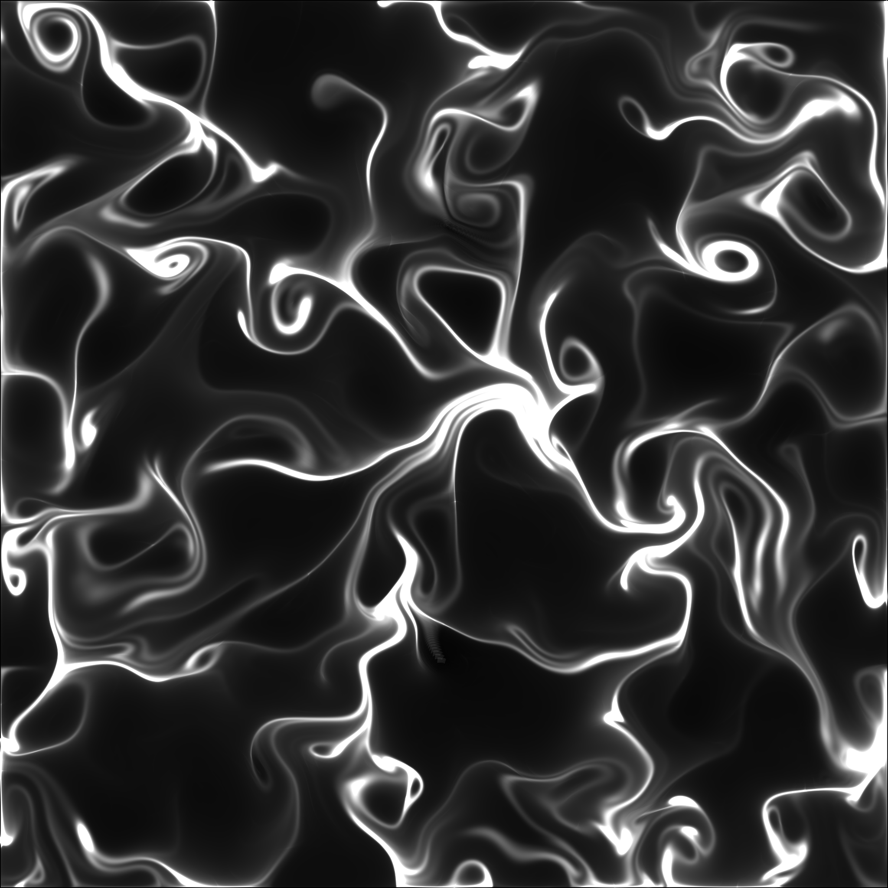
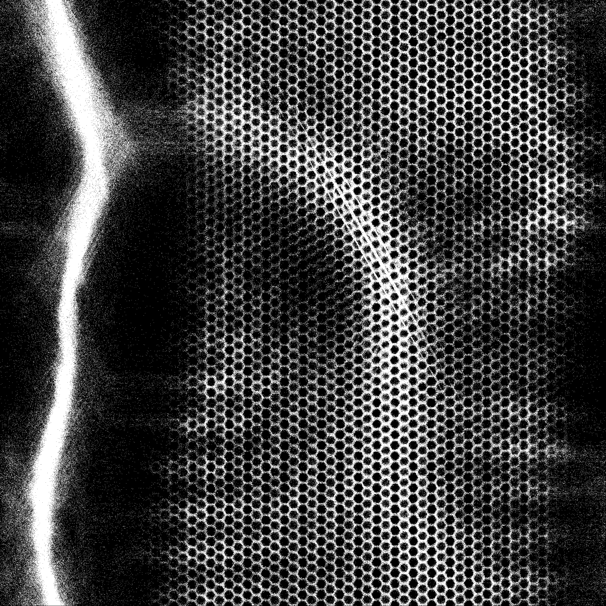
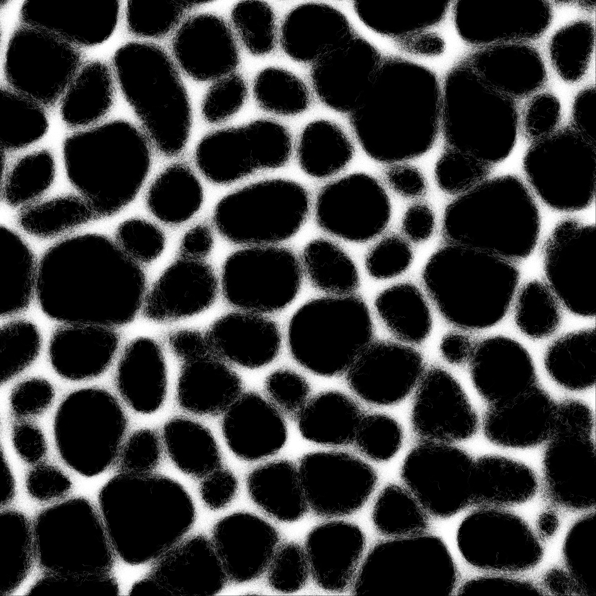
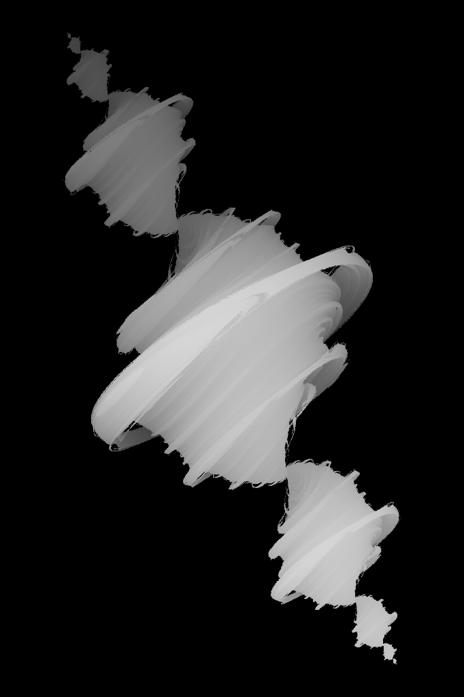

Various visualizations and simulations using pytorch

Fluid simulation:
[4096 x 2048 video](https://www.youtube.com/watch?v=-dA5eCxqJGM)

Burning ship fractal:

"Physarum" simulation:

Quaternionic Julia set:

